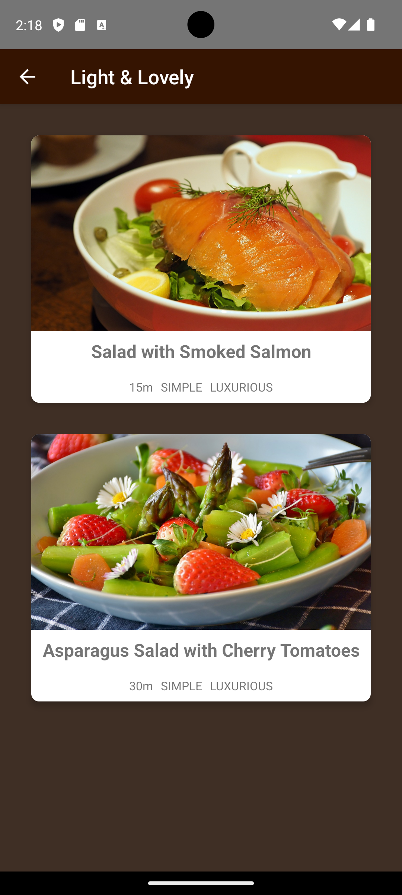
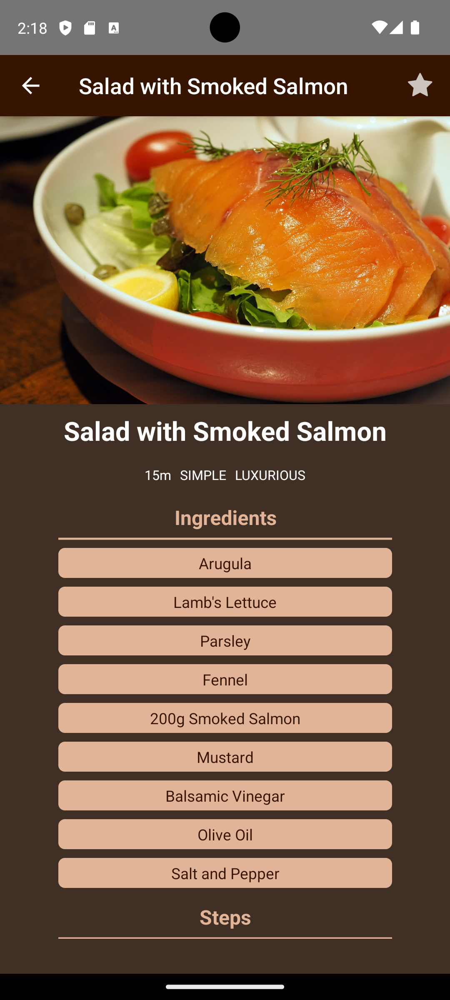

# Meal & Recipe


This is a simple Meals and Recipe app built using React Native. This repository contains the source code for a user-friendly React Native app that empowers you to explore and manage your culinary adventures. Dive into a world of delicious recipes, categorized for easy navigation, and streamline your meal planning with a convenient favorites list.

This is a new [**React Native**](https://reactnative.dev) project, bootstrapped using [`@react-native-community/cli`](https://github.com/react-native-community/cli).

## Features

- Custom Pressable Button Component
- FlatList for displaying previous guesses
- Utilizes latest JavaScript and React features
- Styled with React Native StyleSheet
- Implemented using React Hooks
- Cross-platform code for Android and iOS
- Latest features of JavaScript i.e. ES6, ES7, ES8 is used
- **Categorized Meals**
- **Detailed Recipes**
- **Favorable Favorites List**
- **Multiple Screens** 
- **Nested Navigation**: (**Native Stack**, **Drawer**, **Stack** ) 
- **Store Data Management**

### Few Screenshots

   


# Getting Started

>**Note**: Make sure you have completed the [React Native - Environment Setup](https://reactnative.dev/docs/environment-setup) instructions till "Creating a new application" step, before proceeding.

## Step 1: Start the Metro Server

First, you will need to start **Metro**, the JavaScript _bundler_ that ships _with_ React Native.

To start Metro, run the following command from the _root_ of your React Native project:

```bash
# using npm
npm start

# OR using Yarn
yarn start
```

## Step 2: Start your Application

Let Metro Bundler run in its _own_ terminal. Open a _new_ terminal from the _root_ of your React Native project. Run the following command to start your _Android_ or _iOS_ app:

### For Android

```bash
# using npm
npm run android

# OR using Yarn
yarn android
```

### For iOS

```bash
# using npm
npm run ios

# OR using Yarn
yarn ios
```

If everything is set up _correctly_, you should see your new app running in your _Android Emulator_ or _iOS Simulator_ shortly provided you have set up your emulator/simulator correctly.

This is one way to run your app — you can also run it directly from within Android Studio and Xcode respectively.

